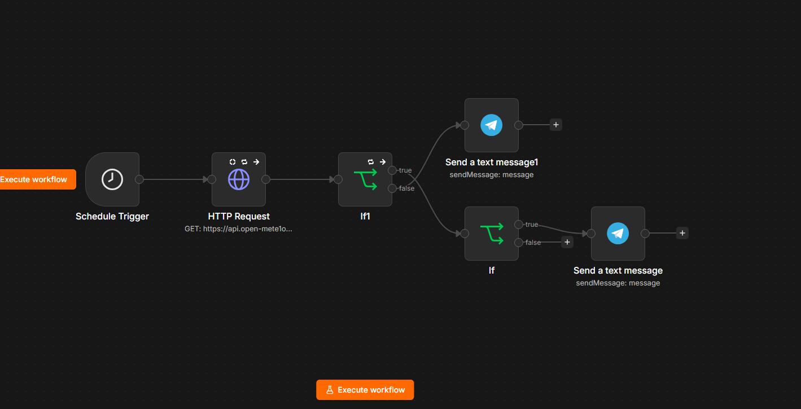
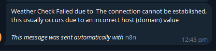

# RainChecker

RainChecker is an n8n automation that checks the daily weather forecast and sends a Telegram notification when rain is likely.

The workflow runs automatically every day at midnight, retrieves the weather forecast, checks the probability of precipitation, and alerts the user when the probability is above 50%.

It also includes a basic error-handling check that sends a Telegram notification if the weather API fails or returns unexpected data.

## Overview

RainChecker automates a simple daily weather check so there is no need to manually look at the forecast every morning.

The workflow follows two main paths:

* **Rain detected:** Send a Telegram notification when the probability of precipitation is above 50%.
* **API failure:** Send a Telegram notification if the weather API cannot provide usable forecast data.
* **No rain expected:** Do nothing when the probability is 50% or lower.

## How It Works

```text
                    Every Day at 12:00 AM
                              |
                              v
                       Weather API
                              |
                    +---------+---------+
                    |                   |
               API works            API fails
                    |                   |
                    v                   v
              Check response       Send Telegram
                    |               error alert
                    v
          Check precipitation
             probability
                    |
              +-----+-----+
              |           |
            > 50%       <= 50%
              |           |
              v           v
        Send Telegram   Do Nothing
         rain alert
```

## Workflow

1. The workflow starts automatically at **12:00 AM every day**.
2. It sends a request to a weather API to retrieve the forecast.
3. The workflow checks whether the API returned usable weather data.
4. If the API request fails or the response is invalid, a Telegram error notification is sent.
5. If the weather data is valid, the precipitation probability is checked.
6. If the probability is **greater than 50%**, a Telegram rain alert is sent.
7. If the probability is **50% or lower**, the workflow ends without sending a notification.

## What I Built

* Scheduled daily automation using n8n
* Weather API integration
* Precipitation probability check
* Conditional branching using n8n
* Telegram notifications
* Basic API failure detection
* Separate handling for successful and failed weather checks
* A no-action path when rain is unlikely

## Technologies Used

* **n8n** — Workflow automation
* **Weather API** — Provides forecast data
* **Telegram** — Sends weather and error notifications

## Example Notifications

### Rain Alert

```text
RainCheck Alert

Rain is likely today.
There is a greater than 50% chance of precipitation.
```

### API Error

```text
Weather Check Failed

I couldn't retrieve today's weather forecast.
The weather API may be unavailable or returned unexpected data.
```

## Screenshots

### Workflow



### Rain Notification


### API Error Notification



## Workflow File

The exported n8n workflow can be found here:

[RainCheck Workflow](RainChecker/workflow/rainchecker.json)

## Security

Any sensitive values have been removed or replaced with placeholders before publishing.

## What I Learned

Building RainChecker helped me understand how to combine scheduled triggers, external APIs, conditional logic, and messaging services in n8n.

I also added basic error handling so the workflow does not assume that an external API will always work. Instead, it can detect when the weather data is unavailable and notify the user.

## Why I Built It

I built RainChecker as a small practical automation project to explore how n8n can be used to connect an external API with a notification service and make a repetitive daily task automatic.
